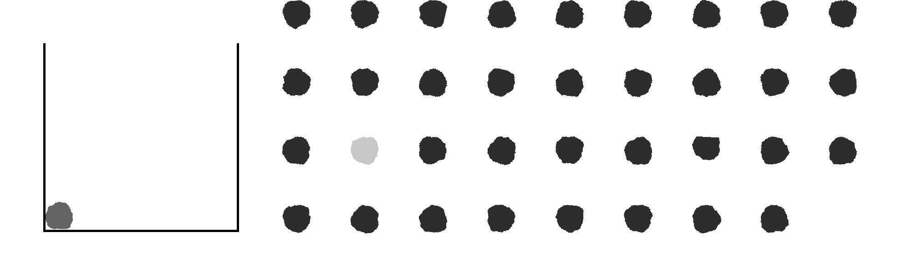

# Stable packing irregular stones in 2D masonry wall construction

# Installation

- create virtual environment in the current directory with `python -m venv env` and `source env/bin/activate`.
- run `pip install -e .` in this directory for an editable install

# Structure

The code is structured into two parts:

1. The first part in _Stonepacker2D_ contains the functionalities for manipulating stones.
2. The second part in _Tests_ contains dataset and the main function to run the examples of stone packing task.

# Examples

To run an example, go to the directory of the example and _python run.py_. Results (images of the constructed wall, sequence etc...) will be stored in the result subfolder.

| Name               | Corresponding figures in paper         | Description                                                  |
| ------------------ | -------------------------------------- | ------------------------------------------------------------ |
| Almeida            | Figure 18, Figure 21, Figure B.30-B.32 | real stone shapes from irregular to regular                  |
| Bricks             | Figure B.34                            | rectangular shapes of fixed sizes                            |
| FFT-stones         | Figures 26-27                          | Stones shapes generated from a Fourier-based shape generator |
| Rubble stone walls | Figures B.33                           | 92 real stone shapes                                         |
| Thangavelu         | Figures 22-25                          | polygonal stones of different noise levels                   |
